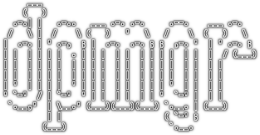
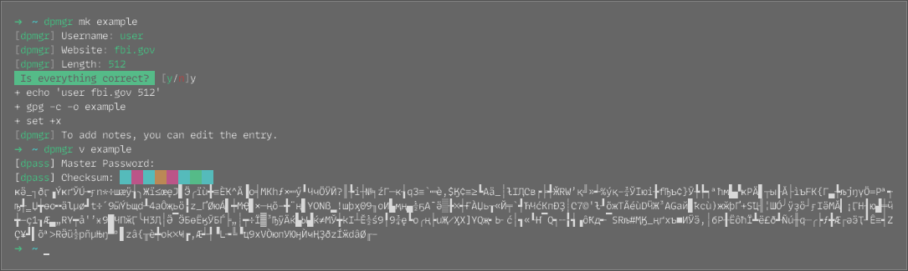

<h1 align=center>
 
</h1>

***dpmgr*** is a helper script for [dpass](http://github.com/disc-8/dpass) that makes it behave more like a traditional password manager, while still not actually storing the passwords on your drive.

# Features
* Passwords not stored
* Minimal, easy to use CLI
* Extremely secure, even if someone cracks the encryption on the files, they don't have your passwords
  * (unless they got the password, and you reused it as the master password. you're fucked in that case lol)
## KNOWN FLAWS
* Entry and category names aren't obscured, but it's really a nothingburger even if your PC gets compromised. You got more things to worry about then than the attacker knowing what kind of freaky midget porno sites you have accounts on.
# Usage
<p align="center">
  
</p>


# Installation
## Dependencies
 * [dpass](http://github.com/disc-8/dpass) (😮 ORLY?)
 * bash
 * gpg
---
```
git clone http://github.com/halperyon/dpmgr
cp ./dpmgr.sh ~/.local/bin/dpmgr
chmod +x ~/.local/bin/dpmgr
```
# To be implemented
- [ ] Tree list (that is not dependant on GNU's `tree`)